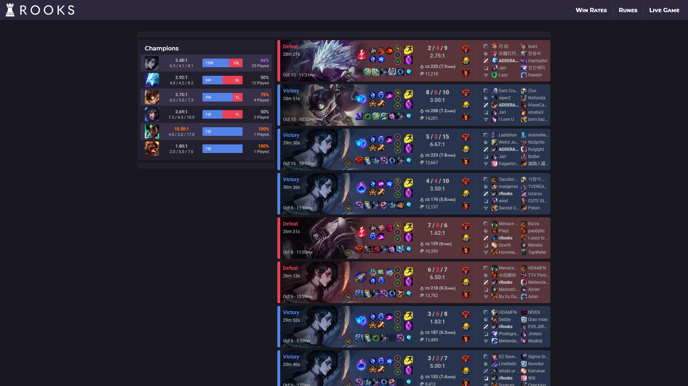
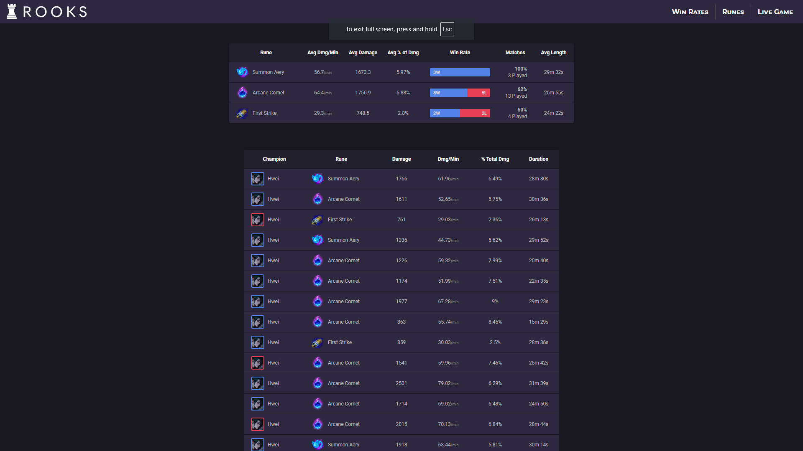
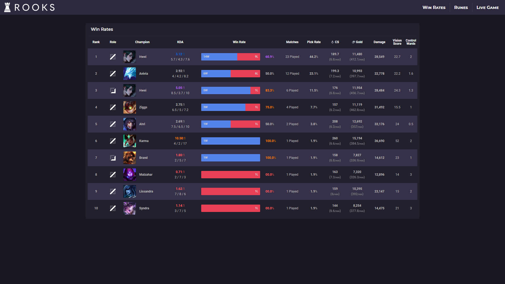
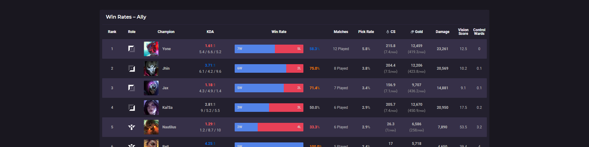
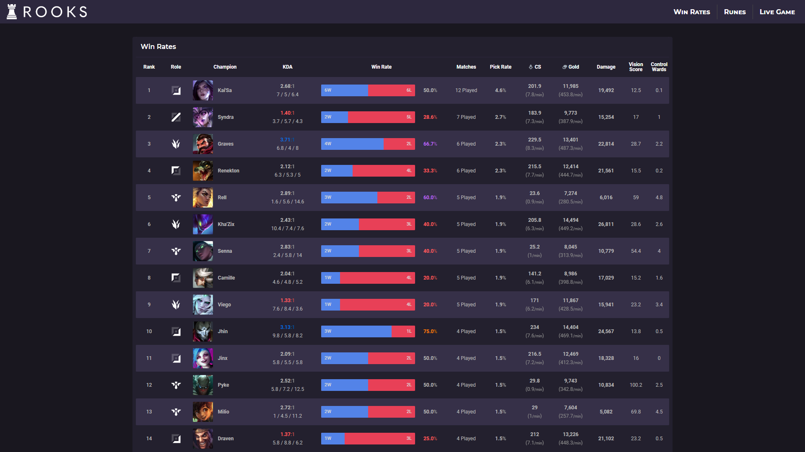

# RooksGG
RooksGG is a data exploration & visualization tool created so that I can easily view specific information for League of Legend match data spanning across multiple accounts & seasons; which is not available on other data exploration tools.

The match data is provided via [RIOT Games' developer API](https://developer.riotgames.com/) & parsed into a format that better fits my needs. This app uses assets provided by RIOT, which are available for each patch release of the game via [Data Dragon's](https://developer.riotgames.com/docs/lol#:~:text=https%3A//ddragon.leagueoflegends.com/cdn/dragontail%2D14.15.1.tgz) dragontail asset files.

[RIOT Developer API Documentation](https://developer.riotgames.com/docs/lol)


### To-Do List (Priority)
- ★ Live game
- Variable font styling; Roboto Flex usage
- Match → More info (detailed match data/outline of all data for individual match)
- Em variable spacing (→ w/r bar, li, etc)
- Proper error handling middleware
- Rune compare data types (hwei → first strike; dmg + gold)
- Tooltip

### Project Directory
```
.
├── node_modules
├── public
│   ├── assets
│   │   ├── dragontail
│   │   │   ├── champion
│   │   │   │   ├── centered
│   │   │   │   ├── loading
│   │   │   │   ├── loadingcrop
│   │   │   │   ├── splash
│   │   │   │   ├── square
│   │   │   │   ├── squarecrop
│   │   │   │   └── tiles
│   │   │   ├── data
│   │   │   │   └── champion
│   │   │   ├── items
│   │   │   ├── item-modifiers
│   │   │   ├── map
│   │   │   ├── passive
│   │   │   ├── perk-images
│   │   │   │   ├── StatMods
│   │   │   │   └── Styles
│   │   │   │       ├── Domination
│   │   │   │       ├── Inspiration
│   │   │   │       ├── Precision
│   │   │   │       ├── Resolve
│   │   │   │       └── Sorcery
│   │   │   ├── profileicon
│   │   │   └── spell
│   │   ├── fonts
│   │   └── icons
│   ├── controllers
│   ├── models
│   ├── plugins
│   └── routes
├── views
│   └── partials
│       └── rows
├── index.js
└── README.md
```

## Dragontail Directory
```
.
├── champion
│   ├── centered
│   │   └── ["id"]_0.jpg	# Aatrox_0.jpg
│   ├── loading
│   │   └── ["id"]_0.jpg
│   ├── loadingcrop
│   │   └── ["id"]_0.jpg
│   ├── splash
│   │   └── ["id"]_0.jpg
│   ├── square
│   │   └── ["id"].png		# Aatrox.png
│   ├── squarecrop
│   │   └── ["id"].png
│   └── tiles
│       └── ["id"]_0.jpg
├── data
├── item
│   └── ["id"].png
├── item-modifiers
├── map
├── passive
├── perk-images
│   ├── StatMods		# png
│   └── Styles
│       ├── Domination
│       ├── Inspiration
│       ├── Precision
│       ├── Resolve
│       ├── Sorcery
│       └── [icon-files.png]
├── profileicon			# png
└── spell			# png
```


## Routing

### Homepage
An overview for match data for my most recent 20 matches. Allows me to quickly see how I am performing on my most played champions, *along with showing me what champions I have been consistently losing to (TO DO)*. More general data for individual matches is also displayed, giving an overview of how my games have been going across all of the accounts that I play on. 




### Rune Value Comparing
```
GET     /runes/value-compare
GET     /runes/value-compare?champion=Hwei&runes=8229&runes=8214&runes=8369		example: compares Summon Aery, Arcane Comet, and First Strike
```

Used to see how much value I am getting for either a given rune or set of runes. The top table displays averages for the given set of runes; while the bottom table shows each match as a row.

I need to make an interface for selecting which runes to view, but for now the desired result is achieved through url query params

I will probably pivot this to be used for other data, but while I build out the functionality of it I intend to keep it to the scope of runes. This was the starting point for the whole data visualization tool, as I wanted to be able to compare the value that I was getting for specific runes; unfortunately doing something like this is not readily available on any of the major, public LoL data sites.




### Win Rate Data
```
GET     /win-rates/personal		finds all of my individual data
GET     /win-rates/ally        	finds all of the data for allied players in my matches
GET     /win-rates/enemy        finds all of the data for enemy players in my matches
GET     /win-rates/overall      finds all of the data for all other players in my matches
```

Displays general champion data for every match recorded in the database. Depending on the route, this data is viewable as either just my personal player data or strictly the other champions in my matches. All routes combine the champion data for matches played across mutliple accounts. This allows for easy viewing of which champions I see the most frequently, as well as which I play the best with & lose against the most.







")


### Match Details
```
GET     /match/details?matchid=NA1_1234567890
```

Simply displays all available data for a given match. Used to allow for an in-depth data analysis for an individual match.


## Development Log

### v2.0.0
**General Code Cleanup**
- Tidied up redundant code, DOM elements, and styles

**Document Structure**
- ALL DATA NOW

**Home Page**
- tinted champion splash arts to reflect victory/defeat; before this, it would get visually confusing when a champion with a blue color scheme was on a loss/red background (ex: Anivia)
- Pivoted match history row layout to accomodate new data
- Match history row, added data for: summoner spells, champion level, trinket, KDA, CSing, gold, control wards purchased, vision score, wards killed, and changed the participants table to show summoner names

**Rune Comparing**
- Mostly visual changes, so that the more important data wasn't drowned out by flavor text(s)
- Added whether a given match was a victory/defeat
- Cleaned up query pipeline

**Win Rates**
- Simplified the front end loading of what data set is being viewed (personal/ally/enemy/overall data)
- Total overhaul of the back end aggregation pipeline; reduced redundancy by better utilizing express middleware and routing techniques
- Now shows winrates, by role, for my personal champions data, overall (ally + enemy, not including myself), ally, and enemy
- Added table values: CS, gold, damage, vision score, control wards purchased *(more will be added!)*


### v1.2.0
**Restructured Table Elements**
- Changed table style visuals from flex boxes to table elements
- Cleaned up/removed win rate routing

**Rune Comparing Functionality**
- Made the query for comparing runes dynamic, taking req.query from the url as inputs


### v1.2.0
**Query Controller**
- Moved the database aggregation to a middleware function
- Reduced code redundancy

**Random Icon**
- Now builds web page through navigation-selection.ejs
- Expanded navigation-selection.ejs dynamics and functionality
- Removed own ejs file

**Visuals Overhaul**
- Color scheme shifted from grey to purple
- CSS variables