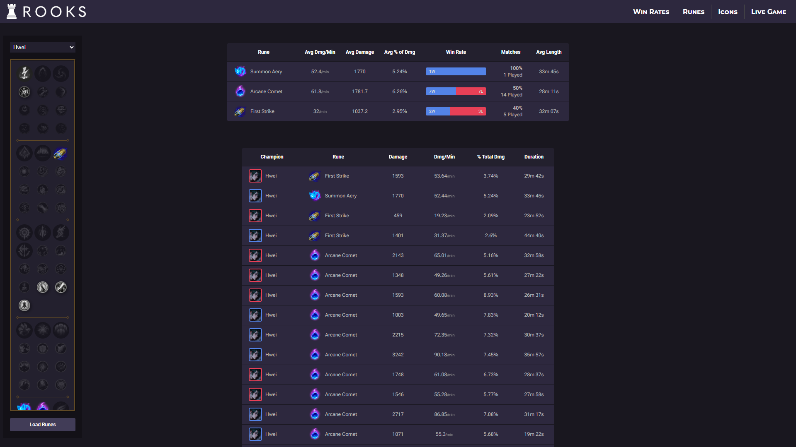
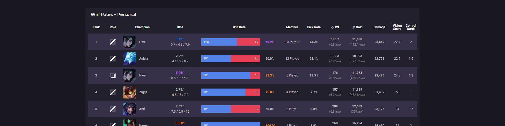
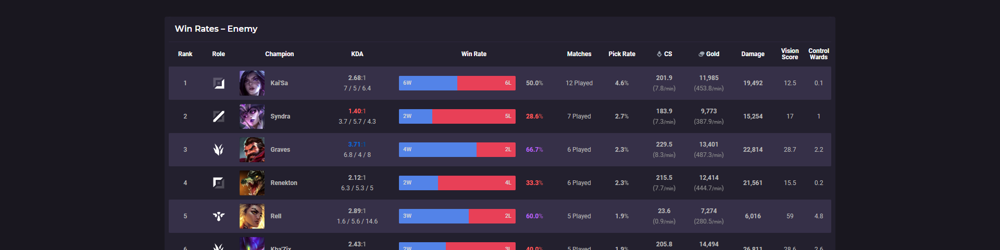

# RooksGG
RooksGG is a data exploration & visualization tool created so that I can easily view specific information for League of Legend match data spanning across multiple accounts & seasons; which is not available on other data exploration tools.

### Riot Games API
The match data is provided via [RIOT Games' developer API](https://developer.riotgames.com/) & parsed into a format that better fits my needs. This app uses assets provided by RIOT, which are available for each patch release of the game via [Data Dragon's](https://developer.riotgames.com/docs/lol#:~:text=https%3A//ddragon.leagueoflegends.com/cdn/dragontail%2D14.15.1.tgz) dragontail asset files.

[RIOT Developer API Documentation](https://developer.riotgames.com/docs/lol)

### Assets
[Dragontail TGZ](https://developer.riotgames.com/docs/lol#:~:text=https%3A//ddragon.leagueoflegends.com/cdn/dragontail%2D14.24.1.tgz)

[CommunityDragon PERKS](https://raw.communitydragon.org/latest/plugins/rcp-be-lol-game-data/global/default/v1/perks.json)


## Project Directory
```
.
├── node_modules
├── public
│   ├── assets
│   │   ├── cdragon		# community dragon assets
│   │   ├── data		# holds personally created/obtained data
│   │   ├── dragontail
│   │   │   ├── champion
│   │   │   │   ├── centered
│   │   │   │   ├── loading
│   │   │   │   ├── loadingcrop		# cropped version of the loading.jpg image; removes black border
│   │   │   │   ├── splash
│   │   │   │   ├── square
│   │   │   │   ├── squarecrop		# cropped version of the square.png image; removes black border
│   │   │   │   └── tiles
│   │   │   ├── data
│   │   │   │   └── champion
│   │   │   ├── items
│   │   │   ├── item-modifiers
│   │   │   ├── map
│   │   │   ├── passive
│   │   │   ├── perk-images
│   │   │   │   ├── StatMods
│   │   │   │   └── Styles
│   │   │   │       ├── Domination
│   │   │   │       ├── Inspiration
│   │   │   │       ├── Precision
│   │   │   │       ├── Resolve
│   │   │   │       └── Sorcery
│   │   │   ├── profileicon
│   │   │   └── spell
│   │   ├── fonts
│   │   └── icons
│   ├── controllers
│   ├── models
│   ├── plugins
│   └── routes
├── views
│   └── partials
├── index.js
└── README.md
```

## Dragontail Directory
```
.
├── champion
│   ├── centered
│   │   └── ["id"]_0.jpg	# Aatrox_0.jpg
│   ├── loading
│   │   └── ["id"]_0.jpg
│   ├── loadingcrop
│   │   └── ["id"]_0.jpg
│   ├── splash
│   │   └── ["id"]_0.jpg
│   ├── square
│   │   └── ["id"].png		# Aatrox.png
│   ├── squarecrop
│   │   └── ["id"].png
│   └── tiles
│       └── ["id"]_0.jpg
├── data
├── item
│   └── ["id"].png
├── item-modifiers
├── map
├── passive
├── perk-images
│   ├── StatMods		# png
│   └── Styles
│       ├── Domination
│       ├── Inspiration
│       ├── Precision
│       ├── Resolve
│       ├── Sorcery
│       └── [icon-files.png]
├── profileicon			# png
└── spell			# png
```


## Routing

### Homepage
An overview for match data for my most recent 30 matches. Allows me to quickly see how I am performing on my most played champions across all of my accounts. Key data for individual matches is displayed in order of most recently played, giving an overview of how my games have been going & allowing me to easily see performance kpi.

Tooltips are available to show rune values (a stat otherwise unavailable on major data sites). Along with an *accurate* value for displaying the number of control wards that I used for each game. The most popular data tool for LoL data ([OP.GG](https://www.op.gg/)) shows the number of control wards *purchased*, whereas mine displays the number of control wards *placed*. This is a crucial difference, as buying a ward (without ever placing it) & actually having a ward down on the map are two different pieces of information.

##### *(Matches can be seen grouped together on the right side of the match history column; indicating that matches were played consecutively in a single "session". Data for these sessions is also displayed, showing the win rate & times that the session began/ended.)*


##### *(Match history can be filtered by account, champion, and/or season via url query params.)*
```
GET     /?champion=Ziggs&account=rRooks
```


### Rune Value Comparing
```
GET     /runes/value-compare
GET     /runes/value-compare?champion=Hwei&runes=8229&runes=8214&runes=8369		example: compares Summon Aery, Arcane Comet, and First Strike
```

Used to see how much value I am getting for either a given rune or set of runes. The top table displays averages for the given set of runes; while the bottom table shows each match as a row.

##### *(Rune selection interface is still a WIP)*

I will probably pivot this to be used for other data, but while I build out the functionality of it I intend to keep it to the scope of runes. This was the starting point for the whole data visualization tool, as I wanted to be able to compare the value that I was getting for specific runes; unfortunately doing something like this is not readily available on any of the major, public LoL data sites.




### Win Rate Data
```
GET     /win-rates/personal		finds all of my individual data
GET     /win-rates/ally        		finds all of the data for allied players in my matches
GET     /win-rates/enemy        	finds all of the data for enemy players in my matches
GET     /win-rates/overall      	finds all of the data for all other players in my matches
```

Displays general champion data for every match recorded in the database. Depending on the route, this data is viewable as either just my personal player data or strictly the other champions in my matches. All routes combine the champion data for matches played across mutliple accounts. This allows for easy viewing of which champions I see the most frequently, as well as which I play the best with & lose against the most.






")

##### *(Data can be filtered by account, & role can be disabled/enabled.)*
```
GET     /win-rates/*?account=rRooks&role=false      	
```


### Match — Details
```
GET     /match/details?matchid=NA1_1234567890
```

Simply displays all available data for a given match. Used to allow for an in-depth data analysis for an individual match.

##### *(Still mostly a WIP, but most data that can easily interpretted via text is shown.)*


### Match — Live Game
```
GET     /match/live-game			page to search for a given player's live match
GET     /match/live-game/:GameName/:TagLine
```

[OP.GG's](https://www.op.gg/) live game feature has been extremely slow to recognize when a player is in a game, so I decided to just do it myself. Visualizes a current player's live match data; displaying the match's game type, map, start time (EST), game ID, each team's bans, and external links to the live game on popular LoL data tools ([OP.GG](https://www.op.gg/), [U.GG](https://u.gg/), [XDX.GG](https://xdx.gg/), & [Porofessor](https://porofessor.gg/)).

##### Individual player data displayed
- Riot ID & tag line (links to respective player's op.gg profile)
- Champion
- Summoner spells
- Rank (tier, rank, LP)
- Winrate
- Total games played
- Runes

This feature does not utilize the previously referenced database; this instead relies on direct calls to RIOT's API. Due to this making API calls, the pulled data is temporarily stored serverside to avoid having to request the same data again. The pipeline for acquiring the nessecary data is as follows:
1. **[ACCOUNT-V1](https://developer.riotgames.com/apis#account-v1/GET_getByRiotId)** - verifies that an account exists with the provided riot id (game name + tag line) ***[1× call]***
2. **[SPECTATOR-V5](https://developer.riotgames.com/apis#spectator-v5/GET_getCurrentGameInfoByPuuid)** - checks to see if the verified account is currently in a game of League of Legends ***[1× call]***
3. **[LEAGUE-V4](https://developer.riotgames.com/apis#league-v4/GET_getLeagueEntriesForSummoner)** - requests the league data (contains rank information for a player) for each participant present from the spectator response ***[10× calls]***


### Profile Icons
```
GET     /profile-icons/all
```

Used to easily view all of my (more favored) profile icons without undesired ones littering the interface (such as what would show when viewing my profile icons in the client's collection tab); with the added functionality to randomly select an icon! *(if I'm on a losing streak = my icon "ran out of luck")*

I wanted to be able to specify what icon theme to randomly select from, so you're able to filter the left-hand grid display based on the overarching icon theme (this also influences the pool of icons that can be randomly selected). Unfortunately there were no resources available (from datadragon nor from communitydragon) to get both of an icon's name and id, so I had to manually make a JSON file populating said information.

Tooltips for each icon show the name of the icon; and the name is also copied to the clipboard on clicking an icon in the left hand grid or randomly picking an icon (clicking the 'Randomize' button). This is so that the name can then be pasted into the search bar on the icon selection menu within the client (under Collection > Icons) and quickly/easily be selected. Shift clicking on a icon category checkbox will deselect all other options.


### To-Do List (Priority)
- Variable font styling; Roboto Flex usage
- Match → More info (detailed match data/outline of all data for individual match)
- Proper error handling middleware
- Rune compare input selection menu


## Development Log

### v2.2.0
**Live Game**
- Added live game feature, due to OP.GG (and other sites) having in-consistent reliability recently
- Axios & dotenv: new package additions to enable the live game functionality of this project
- Makes direct calls to RIOT's api endpoints using axios
- Basic (account) search feature to check if a player is currently in-game

**Match Details**
- Began working on the front & back end for detailed, individual match statistics
- Currently displays values for all end of game stats for each player

**Variable Font Transition**
- Began experimenting with Roboto Flex


### v2.1.1
**Match Details**
- Routing now references participants db collection; gets full data for all 10 participants for a match
- Began laying out front-end table layout

**Home Page - Sessions**
- Session data now dealt with serverside in a dedicated middleware func

**Profile Icons**
- Added category types to each icon for easier sorting
- Slightly changed the UI layout; added more filter options
- Shift clicking now selects a checkbox + deselects all others
- Clicking an icon or the 'randomize' button now copies the icon name to the clipboard; allowing me to paste the name into the client collection tab to easily find it

**Misc**
- Winrate/KDA 'color class' now determined serverside; now passes through an obj including the value and the class
- Fixed rune routing bug

### v2.1.0
**Profile Icons**
- Random profile icon re-added
- Now shows icon name on hover
- Icon category filter functionality added

**Misc**
- Added sessions to match history (if multiple games were played in 1 sitting, then they get flagged as part of a "session")
- Op.gg links added to match history rows
- Champion icons in the win rate table now link to /?champion=[champion clicked]
- Temporary testing paths were added to experiment with the variable font ROBOTO FLEX
- Began experimenting with visualizations for live game functionality

**Known Bugs**
- Rune comparing randomly ceased functioning


### v2.0.1
**Bug Fix**
- Query param [season=All] now functions for all champions 


### v2.0.0
**General Code Cleanup**
- Tidied up redundant code, DOM elements, and styles

**Document Structure**
- ALL DATA NOW

**Home Page**
- tinted champion splash arts to reflect victory/defeat; before this, it would get visually confusing when a champion with a blue color scheme was on a loss/red background (ex: Anivia)
- Pivoted match history row layout to accomodate new data
- Match history row, added data for: summoner spells, champion level, trinket, KDA, CSing, gold, control wards purchased, vision score, wards killed, and changed the participants table to show summoner names

**Rune Comparing**
- Mostly visual changes, so that the more important data wasn't drowned out by flavor text(s)
- Added whether a given match was a victory/defeat
- Cleaned up query pipeline

**Win Rates**
- Simplified the front end loading of what data set is being viewed (personal/ally/enemy/overall data)
- Total overhaul of the back end aggregation pipeline; reduced redundancy by better utilizing express middleware and routing techniques
- Now shows winrates, by role, for my personal champions data, overall (ally + enemy, not including myself), ally, and enemy
- Added table values: CS, gold, damage, vision score, control wards purchased *(more will be added!)*


### v1.2.0
**Restructured Table Elements**
- Changed table style visuals from flex boxes to table elements
- Cleaned up/removed win rate routing

**Rune Comparing Functionality**
- Made the query for comparing runes dynamic, taking req.query from the url as inputs


### v1.2.0
**Query Controller**
- Moved the database aggregation to a middleware function
- Reduced code redundancy

**Random Icon**
- Now builds web page through navigation-selection.ejs
- Expanded navigation-selection.ejs dynamics and functionality
- Removed own ejs file

**Visuals Overhaul**
- Color scheme shifted from grey to purple
- CSS variables